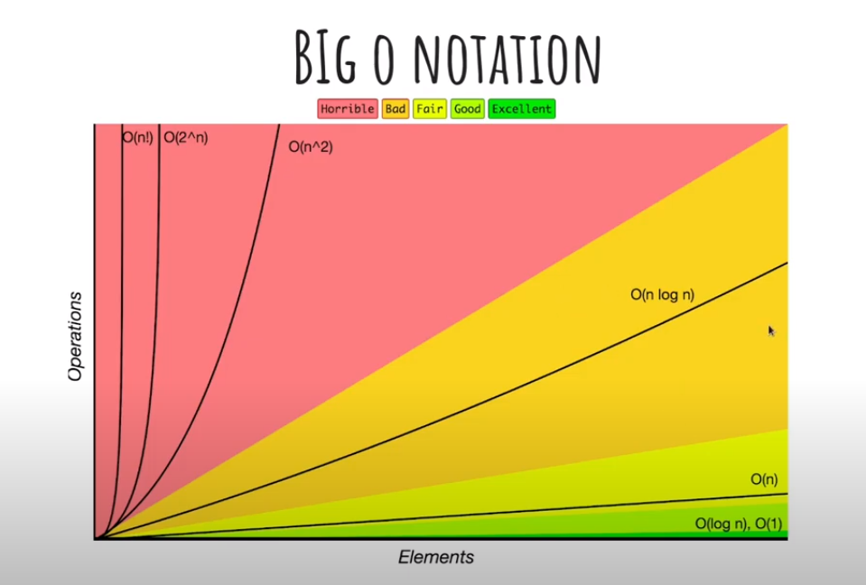

# Big O Notation

Big O, é a notação assintótica mais utilizada para determinar a eficiência de um algoritmo.

É um modelo de classificar o algoritmo pelo seu tempo de execução ou espaço ocupado conforme o nosso input (n) aumenta.

### Desempenho

 - O (n!) (fatorial) corresponde ao número de instruções executadas que crescem muito rapidamente em relação ao pequeno crescimento do número de itens processados. 
É o caso da implementação ingênua do problema do _caixeiro viajante_ ou de algoritmo que gere todas as possíveis permutação de uma lista.

 - O (2^n) (exponencial) é ineficiente, pois o número de instruções cresce muito rapidamente (exponencialmente), ainda que numa taxa menor do que o anterior. 
O que ocorre em algoritmos que fazem busca em árvores binarias não ordenadas.

 - O (n^2) (quadrática) é factível, mas tende a se tornar insuficiente quando a quantidade de dados é suficientemente grande. 
É o caso de algoritmos que têm dois laços (nós encadeados, como por exemplo, o processamento de itens em uma matriz bidimensional.

 - (n log n) (sub-quadrática ou super linear) é mais eficiente que a quadrática. É o caso do algoritmo de ordenação Quick Sort, tem complexidade _C(n)=O(n2)_ no pior caso e _C(n)=O (n logn)_ no melhor e médio caso.

 - O(n) (Linear) é aquele cujo crescimento no número de operações é diretamente proporcional ao crescimento do número de itens. Assim temos algoritmos de busca em uma matriz unidimensional não ordenada.

 - O (log n) (Logaritmo) é aquele que o crescimento do número de operações é menor que o número de itens. É o caso de algoritmos de busca em árvores binárias **(Binary Search Trees)**.

 - O (1) (constante) é aquele em que não há crescimentodo do número de operações pois ele independe do volume de dados de entrada de entrada (n). Tem-se o caso do acesso direto a um elemento de uma matriz.
